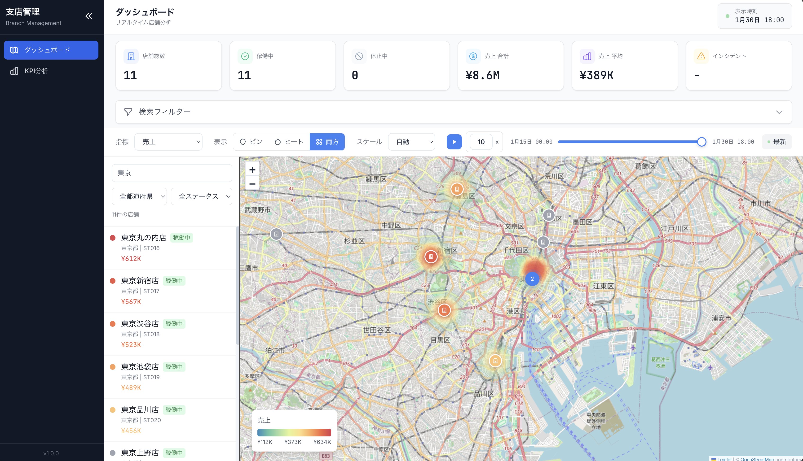

# 全国支店ダッシュボード

全国に支店がある企業向けに、各店舗の情報を地図から一括確認できるダッシュボードアプリケーションです。



## 機能

### ダッシュボード
- **地図表示**: 全国の店舗をピン表示し、クリックで店舗詳細を確認
- **ヒートマップ**: 選択した指標（売上、来客数、インシデント数）に基づき、雨雲レーダー風の色分布で可視化
- **時間軸スライダー**: 過去から現在までの時系列データを再生・確認
- **店舗一覧**: 検索・フィルタ機能付きの店舗リスト
- **KPIカード**: 店舗数、指標の合計・平均などをリアルタイム表示

### KPI分析
- **会社全体/店舗別分析**: 左サイドバーで分析対象を切り替え
- **KPI概要**: 売上・客数・インシデントのカード表示（前年比、目標達成率）
- **期間比較**: 任意の2期間を比較（前年比/前月比/カスタム）
- **要因分解**: 売上変動を客数・単価などの要因に分解

## 技術スタック

### フロントエンド
- Next.js 14 (App Router)
- TypeScript
- Tailwind CSS
- Leaflet + OpenStreetMap
- leaflet.heat (ヒートマップ)
- leaflet.markercluster (マーカークラスタリング)
- TanStack Query (データフェッチング)
- Zustand (状態管理)

### バックエンド
- FastAPI (Python)
- SQLAlchemy ORM
- Alembic (マイグレーション)
- PostgreSQL + PostGIS

### インフラ
- Docker Compose

## ディレクトリ構成

```
.
├── docker-compose.yml
├── backend/
│   ├── Dockerfile
│   ├── requirements.txt
│   ├── alembic.ini
│   ├── alembic/
│   │   └── versions/
│   │       └── 001_initial.py
│   └── app/
│       ├── main.py
│       ├── api/
│       │   ├── stores.py
│       │   └── metrics.py
│       ├── core/
│       │   ├── config.py
│       │   ├── database.py
│       │   └── security.py
│       ├── models/
│       │   ├── store.py
│       │   ├── metric.py
│       │   └── target.py
│       ├── schemas/
│       │   ├── store.py
│       │   └── metric.py
│       └── services/
├── frontend/
│   ├── Dockerfile
│   ├── package.json
│   ├── next.config.js
│   ├── tailwind.config.ts
│   └── src/
│       ├── app/
│       │   ├── layout.tsx
│       │   ├── page.tsx
│       │   ├── globals.css
│       │   ├── providers.tsx
│       │   ├── dashboard/
│       │   │   └── page.tsx
│       │   └── analysis/
│       │       └── page.tsx
│       ├── components/
│       │   ├── Map.tsx
│       │   ├── Legend.tsx
│       │   ├── TimeSlider.tsx
│       │   ├── MetricSelector.tsx
│       │   ├── KPICards.tsx
│       │   ├── EnhancedKpiCard.tsx
│       │   ├── StoreList.tsx
│       │   ├── StoreDetail.tsx
│       │   ├── StoreKpiDetail.tsx
│       │   ├── SearchFilter.tsx
│       │   ├── PeriodPicker.tsx
│       │   ├── KpiComparison.tsx
│       │   ├── KpiDecomposition.tsx
│       │   └── admin/
│       │       ├── AdminLayout.tsx
│       │       ├── DashboardView.tsx
│       │       └── KpiAnalysisView.tsx
│       ├── lib/
│       │   ├── api.ts
│       │   ├── store.ts
│       │   └── colors.ts
│       └── types/
│           ├── index.ts
│           └── leaflet-heat.d.ts
├── db/
│   └── init/                 # DB初期化スクリプト
└── scripts/
    └── init-db.sh
```

## 起動手順

### 1. 事前準備

Docker と Docker Compose がインストールされていることを確認してください。

### 2. 起動

```bash
# プロジェクトルートで実行
docker compose up -d --build
```

### 3. データベース初期化

初回起動時にデータベースのマイグレーションとシードデータの投入を行います。

```bash
# バックエンドコンテナに入る
docker compose exec backend bash

# マイグレーション実行
alembic upgrade head

# シードデータ投入
python -m app.seed

# 終了
exit
```

### 4. アクセス

- フロントエンド: http://localhost:3001
- バックエンドAPI: http://localhost:8001
- APIドキュメント: http://localhost:8001/docs

## 主要画面の使い方

### 指標切替

画面上部の「指標」ドロップダウンで表示する指標を選択できます：
- **売上**: 店舗の売上金額
- **来客数**: 来店した顧客数
- **インシデント数**: オープン中のインシデント件数

### 表示モード

「表示」ボタンで地図の表示方法を切り替えられます：
- **ピン**: 店舗マーカーのみ表示（色は指標値に応じて変化）
- **ヒート**: ヒートマップ（雨雲レーダー風）のみ表示
- **両方**: ピンとヒートマップを重ねて表示

### スケール設定

「スケール」ドロップダウンで色のスケールを設定できます：
- **自動**: 現在表示中のデータの最小〜最大値で自動調整
- **固定**: ユーザーが指定した最小〜最大値で固定

### 時間軸スライダー

- スライダーを左右にドラッグして過去〜現在の時刻を選択
- **再生ボタン（▶）**: 時間を自動で進める
- **速度ボタン（x1/x2/x4）**: 再生速度を変更
- **最新ボタン**: 最新時刻にジャンプ

## API仕様

### 店舗API

| メソッド | エンドポイント | 説明 |
|---------|---------------|------|
| GET | /api/stores | 店舗一覧取得 |
| GET | /api/stores/{id} | 店舗詳細取得 |
| POST | /api/stores | 店舗作成（要認証） |
| PUT | /api/stores/{id} | 店舗更新（要認証） |
| DELETE | /api/stores/{id} | 店舗削除（要認証） |
| POST | /api/stores/import | 店舗CSVインポート（要認証） |

### 指標API

| メソッド | エンドポイント | 説明 |
|---------|---------------|------|
| GET | /api/metrics | 指定時刻の指標データ取得 |
| GET | /api/metrics/summary | 指定時刻の集計データ取得 |
| GET | /api/metrics/time-range | データ存在期間取得 |
| GET | /api/metrics/stores/{id} | 店舗別時系列データ取得 |
| GET | /api/metrics/kpi/summary | KPIサマリー（前年比・目標達成率）取得 |
| GET | /api/metrics/kpi/comparison | 期間比較データ取得 |
| GET | /api/metrics/kpi/decomposition | 要因分解データ取得 |
| POST | /api/metrics/import | 指標CSVインポート（要認証） |

### 時刻補間の仕様

指標取得時に指定した時刻（ts）に完全一致するデータがない場合、**直前補間（latest at or before）**を採用しています。つまり、指定時刻以前で最も新しいデータを返します。

## CSVインポート仕様

### 店舗CSV（stores.csv）

| カラム | 必須 | 説明 |
|--------|------|------|
| store_code | ○ | 店舗コード（ユニーク） |
| name | ○ | 店舗名 |
| address | ○ | 住所 |
| prefecture | ○ | 都道府県 |
| lat | ○ | 緯度 |
| lng | ○ | 経度 |
| status | ○ | ステータス（active/inactive） |
| phone | - | 電話番号 |
| manager_name | - | 責任者名 |

### 指標CSV（metrics.csv）

| カラム | 必須 | 説明 |
|--------|------|------|
| store_code | ○ | 店舗コード |
| ts | ○ | タイムスタンプ（ISO8601形式） |
| sales | - | 売上 |
| customers | - | 来客数 |
| incidents_open | - | オープンインシデント数 |

## セキュリティ

管理系API（POST/PUT/DELETE）は`X-API-Key`ヘッダーでの認証が必要です。

```bash
curl -X POST http://localhost:8001/api/stores \
  -H "Content-Type: application/json" \
  -H "X-API-Key: dev-secret-key-change-in-production" \
  -d '{"store_code": "ST999", ...}'
```

## 環境変数

### バックエンド

| 変数名 | デフォルト値 | 説明 |
|--------|-------------|------|
| DATABASE_URL | postgresql://postgres:postgres@db:5432/branch_dashboard | DB接続URL |
| API_SECRET_KEY | dev-secret-key-change-in-production | API認証キー |

### フロントエンド

| 変数名 | デフォルト値 | 説明 |
|--------|-------------|------|
| NEXT_PUBLIC_API_URL | http://localhost:8001 | APIベースURL |


## パフォーマンスについて

- 店舗数 5,000〜30,000件を想定した設計
- 指標取得時はbbox（表示範囲）でのフィルタリングをサポート
- 時系列クエリはstore_id + tsの複合インデックスで最適化
- フロントエンドはスライダー操作時にデバウンス処理を適用
